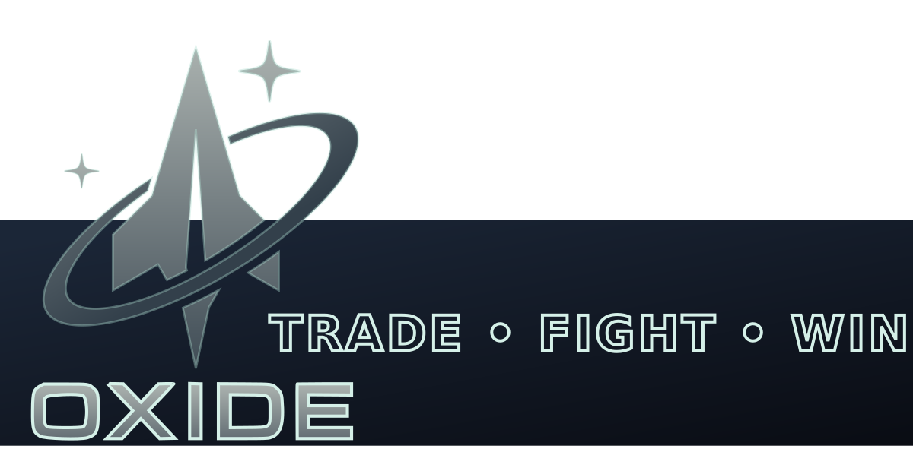

# Project Oxide



> **A lightweight, fully‑authoritative real‑time space‑sim framework built in modern C++23.**

Project Oxide is an internal R&D code‑base that demonstrates how far a *clean, library‑per‑layer* architecture can go without the baggage of a monolithic “engine.”  Each subsystem is its own CMake target; the top‑level apps just link what they need.

This repository purposely avoids hype‑driven rewrites.  No ECS.  No data‑oriented crusade.  Just conventional interfaces + factories (see `CPP_MANUAL.md`) and plain old objects.

---

## 🔑  Goals

| Tier    | Milestone                                                  | Outcome                                                                         |
| ------- | ---------------------------------------------------------- | ------------------------------------------------------------------------------- |
| **MVP** | Static single‑player sandbox                               | Ship spawns, sc-like motion, HUD, and projectiles with deterministic rollback. |
| **R1**  | Headless **zone** server + authoritative client prediction | 30 Hz tick rate, client interpolation, bullet‑proof reconnection.               |
| **R2**  | Multi‑zone universe router (**unid**)                      | Transparent warp between zone shards, hot‑patch asset streaming.                |
| **R3**  | Public alpha                                               | Self‑contained dedicated server binary & automatic asset diff‑patcher.          |

---

## 📁  Repository Layout

```text
/apps
   client/    ← Desktop GUI launcher (bgfx + ImGui)
   zoned/     ← Headless zone‑simulation server
   unid/      ← Universe‑directory + matchmaking service
/libs
   asset/     ← glTF loader, meshoptimizer, IBL bake cache
   audio/     ← miniaudio device, 3D voice emitter wrapper
   core/      ← Error wrapper, logger, fixed allocators, timing helpers
   crypto/    ← Cryptographic utilities
   physics/   ← Bullet‑backed hull cache & collision queries
   protocol/  ← Network protocol definitions
   render/    ← bgfx init, view & frame orchestration, PBR shader registry
   ui/        ← ImGui context per‑view, dockspace, debug widgets
/assets       ← Game assets (public & private)
/docs         ← Documentation and design files
/scripts      ← Build and utility scripts
/vcpkg.json   ← Locked manifest of third‑party ports
```

All core/business logic lives in libraries under `/libs`.  Apps are thin façades that compose libs.

---

## 🛠  Prerequisites

| Requirement      | Version                        | Notes                                                   |
| ---------------- | ------------------------------ | ------------------------------------------------------- |
| **CMake**        | **≥ 3.28**                     | Needed for Unity builds & pre‑compiled headers.         |
| **C++ Compiler** | Clang 16 / GCC 13 / MSVC 19.39 | Must fully support C++23.                               |
| **vcpkg**        | Latest master                  | Manifest mode only; repo ships `vcpkg.json` + lockfile. |

### Ubuntu 24.04 Boilerplate

```bash
sudo apt update && sudo apt install -y \
  git build-essential ninja-build pkg-config cmake \
  libx11-dev libxi-dev libxrandr-dev libxinerama-dev libxcursor-dev libxfixes-dev \
  libgl1-mesa-dev libglu1-mesa-dev libssl-dev zlib1g-dev \
  autoconf libtool automake
```

### macOS 12+  (Homebrew)

```bash
brew install git cmake ninja pkg-config libtool autoconf automake
```

### Windows 10/11 (PowerShell admin)

**Step 1. Download build-time dependencies**

```powershell
choco install -y git cmake ninja
```

**Step 2. Make sure you have the VS2022 Build Tools and Windows SDK installed.**

Use the Visual Studio installer. Select “C++ Desktop development”, plus “Windows 11 SDK” if offered.

---

## 🔗  Third‑Party Libraries (via vcpkg)

- **bgfx** – cross‑platform renderer (GL / Vulkan / Metal / D3D)
- **glfw3** – window + input
- **ImGui** – immediate‑mode UI (no browser dependency)
- **glm** – math (deterministic, header‑only)
- **Bullet 3** – convex hull generation & collision queries only (movement is deterministic via glm)
- **libuv** – cross‑platform TCP/UDP/event loop
- **miniaudio** – tiny 3‑D sound
- **nlohmann‑json**, **tomlplusplus** – config/serialisation
- **meshoptimizer**, **cgltf**, **stb** – asset import helpers

All versions are locked by `builtin-baseline` + overrides in `vcpkg.json`.

---

## 🚀  Quick Start

```bash
# clone + bootstrap vcpkg once
$ git clone --recursive https://github.com/<org>/oxide.git
$ cd oxide
$ ./scripts/bootstrap.sh        # bootstraps vcpkg & installs deps

# configure & build via CMake presets (Debug)
$ cmake --preset debug            # generates out/build-debug/
$ cmake --build --preset debug --target client

# run the sandbox
$ out/build-debug/apps/client --dev
```

Unity builds and PCH are enabled by default to keep compile times civil.

---

## ©️ License & Asset Policy

| Part                                                           | License                                            | Notes                                                                                         |
| -------------------------------------------------------------- | -------------------------------------------------- | --------------------------------------------------------------------------------------------- |
| **C++ source code** (`src/`, `include/`, build scripts, tests) | **GNU AGPL v3**                                    | Copy, fork, redistribute *code* under copyleft terms.  External contributors welcome.         |
| **Default fallback assets** (`assets/public/`)                 | CC‑0 / public‑domain                               | Low‑poly models & textures used for CI and open‑source builds.                                |
| **Proprietary asset packs** (`assets/private/`)                | 💰 Commercial (Synty Polygon packs + internal art) | **Not** in the repo.  Only Oat Interactive staff with valid licenses may use or redistribute. |

### Building with public assets (anyone)

```bash
cmake --preset debug
cmake --build --preset debug --target client
# Runs with CC‑0 ships & UI; perfect for pull‑requests.
```

### Building with proprietary assets (employees only)

1. Mount the studio asset share or grab the encrypted *.pak* from the asset vault.
2. Run the helper script (it validates the license hash and unpacks):
   ```bash
   ./scripts/get_assets_internal.sh  # copies into assets/private/
   ```
3. Configure with the **internal preset** which toggles the proprietary‐asset CMake option:
   ```bash
   cmake --preset debug-internal     # sets -DOXIDE_USE_PRIVATE_ASSETS=ON
   cmake --build --preset debug-internal --target client
   ```
4. Distributing binaries: *Publish the compiled **`.pak`** plus the AGPLv3 notice; DO NOT upload Synty source files.*

`OXIDE_USE_PRIVATE_ASSETS` is runtime‑checked.  If the .pak file isn’t present the executable silently falls back to the public models so external contributors can still run the game.

---

## 🧩  Library Breakdown

| Lib        | What it owns                                               |
| ---------- | ---------------------------------------------------------- |
| **core**   | Error wrapper, logger, fixed allocators, timing helpers    |
| **math**   | glm aliases, units, deterministic helpers                  |
| **net**    | Reliable UDP, compression, snapshot/rollback pipes         |
| **sim**    | Ships, projectiles, world grid, deterministic integrator   |
| **phys**   | Bullet‑backed hull cache & broad‑phase collision queries   |
| **asset**  | glTF loader, meshoptimizer, IBL bake cache                 |
| **render** | bgfx init, view & frame orchestration, PBR shader registry |
| **ui**     | ImGui context per‑view, dockspace, debug widgets           |
| **audio**  | miniaudio device, 3‑D voice emitter wrapper                |

Apps link only what they use.  `zoned` omits `ui`, `audio`; `unid` omits `render` entirely.

---

## 🧪  Tests & CI

- All libraries expose deterministic, headless tests in `./tests` (Catch2).
- GitHub Actions matrix: `ubuntu‑24.04`, `macos‑14`, `windows‑2022` (MSVC).  Each job:
  1. Caches vcpkg installed dir.
  2. `cmake .. -DCMAKE_TOOLCHAIN_FILE=$VCPKG_ROOT/scripts/buildsystems/vcpkg.cmake`
  3. Builds Unity+PCH, runs tests, packages artifacts.

---

## 🤝  Contributing

Please read **CONTRIBUTING.md** for coding standards, branch flow and AI‑generated content rules before opening a pull‑request.

---

## 📜  License


All C++ source under **GNU AGPL v3**.  Public‑domain fallback assets under CC‑0.  Proprietary packs remain commercial.

See `LICENSE` for the full text.

---

> "Engines are optional.  Clean code isn’t." – Oxide Team

---

## 🛰️ Networking model

*Baseline first, polish later.*  Oxide starts with **brute‑force position replication**: each simulation tick the server sends a compact `PosRot` for every entity in scope.  No delta compression, no rewind, just the dumb pipe.  It proves serialization, visibility culling, and packet budgeting *before* we waste weeks on prediction that might not be needed.  Once we can measure bandwidth and jitter we evolve to interpolation / interest management in measured steps.

## 🚗 Movement model

Ships behave like top‑down cars, **not** Asteroids.  `W/S` (or Up/Down) adjusts scalar speed; `A/D` (or Left/Right) rotate the forward vector.  Momentum always re‑aligns with the current heading—there’s no reversing thrust to drift backwards.  This keeps controls intuitive for new players and simplifies collision response against Bullet hulls.