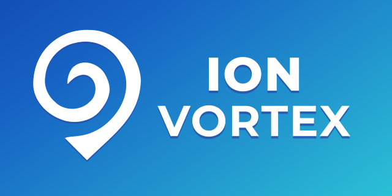

# Ion Vortex

---

  

---

> A lightweight, fully-authoritative real-time space-sim framework built in modern C++23.

**Current Milestone (Tier 0):**  
Spawn a single ship in one zone with car-style steering, 30 Hz deterministic sim on the server, and SDL3+ImGui rendering on the client.  
See the full [Roadmap](docs/development/README.md#roadmap) for what's next!

---

# 📖 [Documentation](docs/README.md)

## 🚀 Getting Started
- **Prerequisites & Bootstrap** → [docs/getting-started/prerequisites.md](docs/getting-started/prerequisites.md)
- **Build & Run** → [docs/getting-started/building.md](docs/getting-started/building.md)
- **Your First App** → [docs/getting-started/first-app.md](docs/getting-started/first-app.md)

## 🛠 Development
- **Build System & Dependencies** → [docs/development/build-system.md](docs/development/build-system.md)
- **Creating Libraries** → [docs/development/creating-libraries.md](docs/development/creating-libraries.md)
- **Creating Applications** → [docs/development/creating-apps.md](docs/development/creating-apps.md)
- **Testing & CI** → [docs/development/testing.md](docs/development/testing.md)

## 🤝 Contributing & Legal
- **Contributing Guide** → [docs/contributing/README.md](docs/contributing/README.md)
- **Security Policy** → [SECURITY.md](SECURITY.md)
- **License (AGPL-3.0)** → [LICENSE](LICENSE) / [docs/legal/README.md](docs/legal/README.md)
