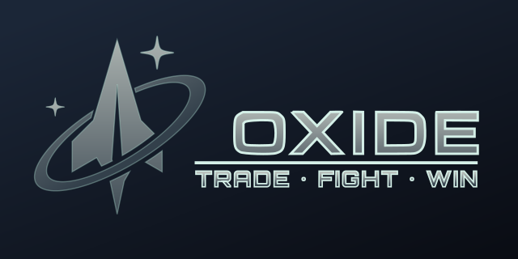

# Project Oxide



> **A lightweight, fully‑authoritative real‑time space‑sim framework built in modern C++23.**

Project Oxide is an internal R&D code‑base that demonstrates how far a *clean, library‑per‑layer* architecture can go without the baggage of a monolithic “engine.”  Each subsystem is its own CMake target; the top‑level apps just link what they need.

This repository purposely avoids hype‑driven rewrites.  No ECS.  No data‑oriented crusade.  Just conventional interfaces + factories and plain old objects.

---

## 🔑  Goals

| Tier    | Milestone                                                  | Outcome                                                                         |
| ------- | ---------------------------------------------------------- | ------------------------------------------------------------------------------- |
| **MVP** | Static single‑player sandbox                               | Ship spawns, sc-like motion, HUD, and projectiles with deterministic rollback. |
| **R1**  | Headless **zone** server + authoritative client prediction | 30 Hz tick rate, client interpolation, bullet‑proof reconnection.               |
| **R2**  | Multi‑zone universe router (**unid**)                      | Transparent warp between zone shards, hot‑patch asset streaming.                |
| **R3**  | Public alpha                                               | Self‑contained dedicated server binary & automatic asset diff‑patcher.          |

---

## 📁  Repository Layout

```text
/apps
   client/    ← Desktop GUI launcher (bgfx + ImGui)
   zoned/     ← Headless zone‑simulation server
   unid/      ← Universe‑directory + matchmaking service
/libs
   asset/     ← glTF loader, meshoptimizer, IBL bake cache
   audio/     ← miniaudio device, 3D voice emitter wrapper
   core/      ← Error wrapper, logger, fixed allocators, timing helpers
   crypto/    ← Cryptographic utilities
   physics/   ← Bullet‑backed hull cache & collision queries
   protocol/  ← Network protocol definitions
   render/    ← bgfx init, view & frame orchestration, PBR shader registry
   ui/        ← ImGui context per‑view, dockspace, debug widgets
/assets       ← Game assets (public & private)
/docs         ← Documentation and design files
/scripts      ← Build and utility scripts
/vcpkg.json   ← Locked manifest of third‑party ports
```

All core/business logic lives in libraries under `/libs`.  Apps are thin façades that compose libs.

---

## 🛠  Prerequisites

See [docs/getting-started/prerequisites.md](docs/getting-started/prerequisites.md) for up-to-date requirements and platform setup instructions.

---

## 🚀  Quick Start

See [docs/getting-started/building.md](docs/getting-started/building.md) for build and run instructions, including CMake presets and vcpkg bootstrap.

---

## 🔗  Third‑Party Libraries (via vcpkg)

See [docs/development/build-system.md](docs/development/build-system.md) for details on dependencies and vcpkg usage.

---

## 🧩  Library Breakdown

See [docs/development/creating-libraries.md](docs/development/creating-libraries.md) for a full breakdown of each library and its responsibilities.

---

## 🧪  Tests & CI

See [docs/development/testing.md](docs/development/testing.md) for information on tests, CI, and supported platforms.

---

## 🤝  Contributing

See [docs/contributing/README.md](docs/contributing/README.md) for coding standards, branch flow, and AI-generated content rules before opening a pull‑request.

---

## 📜  License & Asset Policy

See [docs/legal/README.md](docs/legal/README.md) and [LICENSE](LICENSE) for full license and asset policy details.

---

> "Engines are optional.  Clean code isn’t." – Oxide Team

---

## 📚  More Documentation

- [Development Guide](docs/development/README.md)
- [C++ Manual](docs/development/cpp-manual.md)
- [Game Design](docs/game-design/README.md)
- [API Reference](docs/api/README.md)